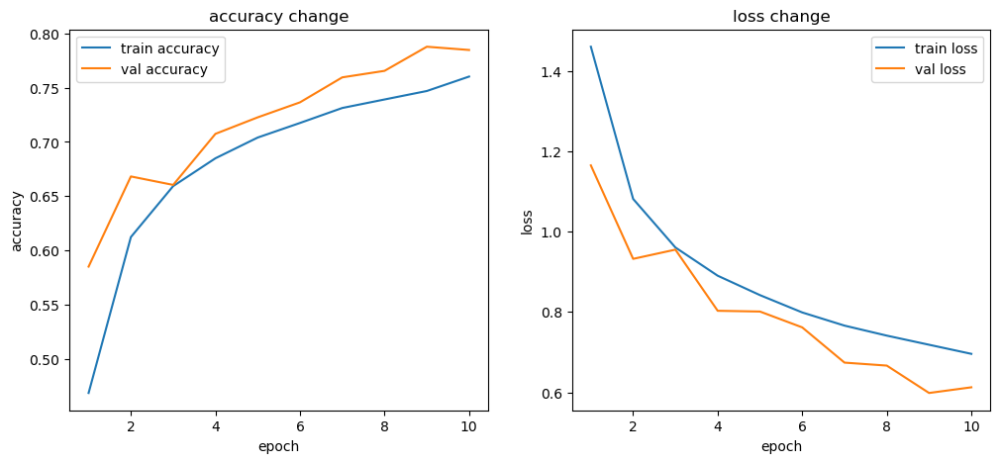

# 분류 모델 성능 분석

CIFAR10 데이터셋에 대한 분류 모델 학습 프로젝트

---

## 🚀 개요

주어진 데이터를 바탕으로 특정 결과를 예측하는 딥러닝 기반의 분류 모델을 개발하는 것을 목표로 했습니다. 
학습 과정 내내 정확도는 꾸준히 상승되었고, 손실 값은 안정적으로 감소하는 모습을 보여, 모델 학습을 성공적으로 시킬 수 있었습니다.

---

## 📋 학습 환경 및 설정

- 프레임워크: PyTorch
- 최적화 도구 (Optimizer): Adam
- 손실 함수 (Loss Function): CrossEntropyLoss
- 학습률 (Learning Rate): 0.001
- 에포크 (Epochs): 10
- 평가 지표: 정확도 (Accuracy), 손실 (Loss)
- 데이터셋: 학습(Training) 데이터와 검증(Validation) 데이터 분리

---

## 📈 학습 결과

### 학습 결과 표
| Epoch | Train Loss | Train Accuracy | Validation Loss | Validation Accuracy |
|-------|------------|----------------|-----------------|---------------------|
| 1     | 1.4599     | 46.89%         | 1.1647          | 58.52%              |
| 2     | 1.0813     | 61.24%         | 0.9322          | 66.82%              |
| 3     | 0.9605     | 65.93%         | 0.9551          | 66.04%              |
| ...   | ...        | ...            | ...             | ...                 |
| 10    | 0.6959     | 76.01%         | 0.6126          | 78.46%              |

### Accuracy and Loss Trends
#### Accuracy
- 학습 정확도는 Epoch마다 상승하여 최종 Epoch에선 **76.01%**까지 상승했습니다.
- 검증 정확도 또한 비슷한 추세로, **78.46%**에 달성했습니다.
- 모델이 특정 데이터에 과적합되지 않고, 새로운 데이터에도 잘 일반화될 수 있음 확인할 수 있었습니다.

#### Loss
- 학습 손실은 지속적으로 감소하며 0.6959까지 감소했습니다. 
- 검증 손실도 마찬가지로 감소하여 0.6126으로 감소했습니다.
- 모델이 안정적으로 학습을 확인할 수 있었습니다.

#### Training VS Validation


---

## 🔍 분석 및 평가

### Key Observations
1. **Performance**:
학습 정확도와 검증 정확도가 모든 에포크에서 꾸준히 향상되었습니다. 검증 정확도가 학습 정확도를 상회하는 모습을 보이며 과적합(Overfitting)의 징후가 나타나지 않았습니다.
2. **Efficiency**:
에포크 10회 만에 성능이 안정적으로 수렴하는 것을 확인했습니다. 이는 모델 학습이 매우 효율적이었음을 의미합니다.

### Strengths
높은 일반화 능력: 훈련 데이터 외의 새로운 데이터에도 우수한 성능을 보입니다.
안정적인 학습 과정: 손실과 정확도 지표가 안정적으로 수렴하며 모델이 잘 학습되었습니다.

### Areas for Improvement
하이퍼파라미터 튜닝: 현재 설정된 학습률이나 배치 사이즈를 조절하여 성능을 더욱 끌어올릴 수 있는 여지가 있습니다.
데이터 증강(Data Augmentation): 데이터셋을 보강하여 모델의 견고함과 일반화 능력을 더욱 향상시킬 수 있습니다.

---

## 🛠 How to Use

### 1. Prepare the Environment
Ensure you have the required dependencies installed. Use the following command to set up:

```bash
pip install -r requirements.txt
```

### 2. Run the Training Script
Train the model using the provided script:

```bash
python train.py
```

### 3. Visualize Results
Generated graphs and logs will be saved in the outputs/ directory.

🌟 향후 최적화 계획
1. 하이퍼파라미터 최적화: 학습률, 배치 사이즈, 모델 구조 등을 세밀하게 튜닝하여 성능을 최적화
2. 데이터 증강 적용: 데이터 증강 기법을 적용해 모델의 일반화 성능을 개선
3. 테스트 데이터셋 평가: 최종적으로 별도의 테스트 데이터셋을 활용해 모델의 최종 성능을 검증

📂 Repository Structure

```bash
├── data/              # 데이터셋
├── outputs/           # 학습 로그 및 시각화 자료
├── train.py           # 모델 학습 스크립트
├── requirements.txt   # 의존성 패키지 목록
└── README.md          # 프로젝트 소개
```
